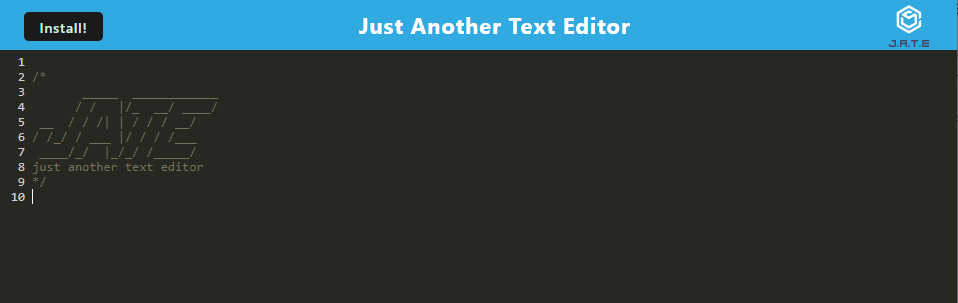
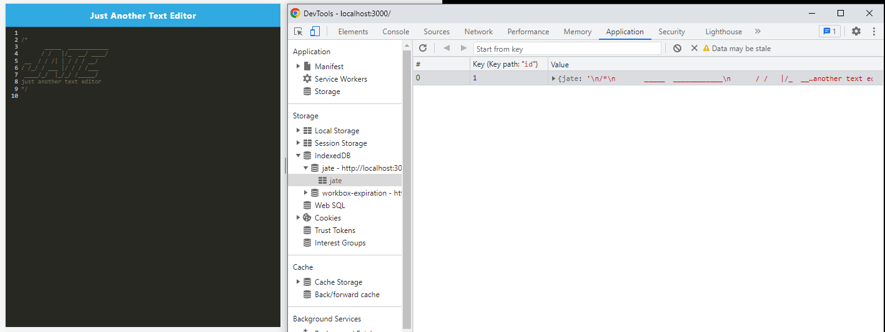
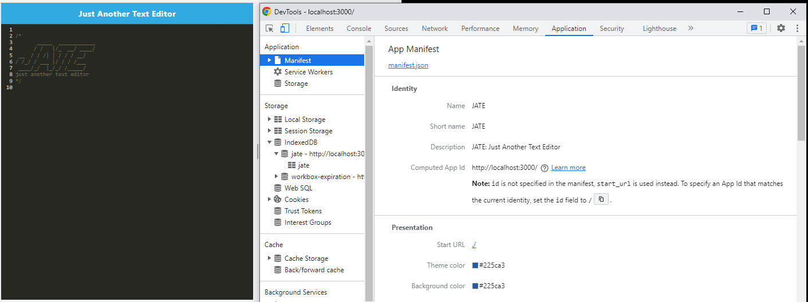
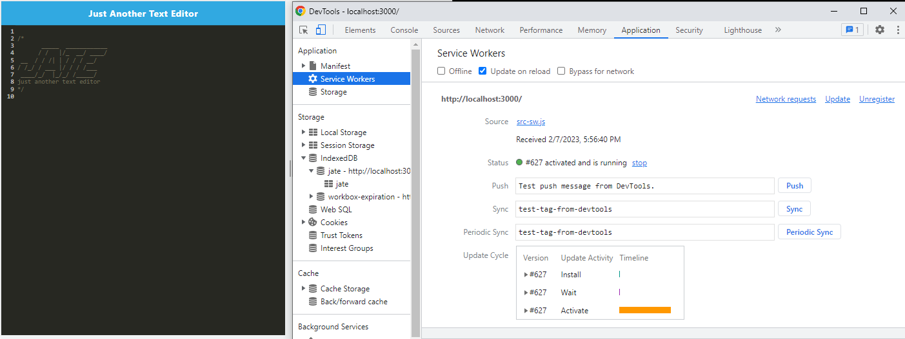

# JATE: Just Another Text Editor

## Description

A Progressive Web Apps(WPA) called text editor that runs in the browser and will also function offline. This app use a package called `idb`, which is a lightweight wrapper around the IndexedDB API. It features a number of methods that are useful for storing and retrieving data.

## Table of Contents
* [Description](#description)
* [User Story](#user-story)
* [Aceptance Criteria](#acceptance-criteria)
* [Installation](#installation)
* [Usage](#usage)
* [Documentation](#documentation)
* [Questions](#questions)

## User Story

```md
AS A developer
I WANT to create notes or code snippets with or without an internet connection
SO THAT I can reliably retrieve them for later use
```

## Acceptance Criteria

```md
GIVEN a text editor web application
WHEN I open my application in my editor
THEN I should see a client server folder structure
WHEN I run `npm run start` from the root directory
THEN I find that my application should start up the backend and serve the client
WHEN I run the text editor application from my terminal
THEN I find that my JavaScript files have been bundled using webpack
WHEN I run my webpack plugins
THEN I find that I have a generated HTML file, service worker, and a manifest file
WHEN I use next-gen JavaScript in my application
THEN I find that the text editor still functions in the browser without errors
WHEN I open the text editor
THEN I find that IndexedDB has immediately created a database storage
WHEN I enter content and subsequently click off of the DOM window
THEN I find that the content in the text editor has been saved with IndexedDB
WHEN I reopen the text editor after closing it
THEN I find that the content in the text editor has been retrieved from our IndexedDB
WHEN I click on the Install button
THEN I download my web application as an icon on my desktop
WHEN I load my web application
THEN I should have a registered service worker using workbox
WHEN I register a service worker
THEN I should have my static assets pre cached upon loading along with subsequent pages and static assets
WHEN I deploy to Heroku
THEN I should have proper build scripts for a webpack application
```

## Installation

To install necessary dependencies, run the following command:

```
npm i
```
* This application use the following dependencies
    * Express
    * if-env
    * babel-loader
    * css-loader 
    * html-webpack-plugin
    * webpack
    * webpack-pwa-manifest
    * workbox-webpack-plugin

## Usage

Clone the repo, navigate to the root folder, run the following commands from the CLI:

```    
npm start
```

## Documentation
Deployed application can be found [here](https://powerful-hollows-53265.herokuapp.com/).

The following image is the screenshot of the application: 
 


The following image shows the application's IndexedDB storage:
 


The following image shows the application's `manifest.json` file:
 


The following image shows the application's registered service worker:
 


## Questions
If you have any questions about this projects, please contact me at test@test.com or more projects on [Github](https://github.com/begirlz)